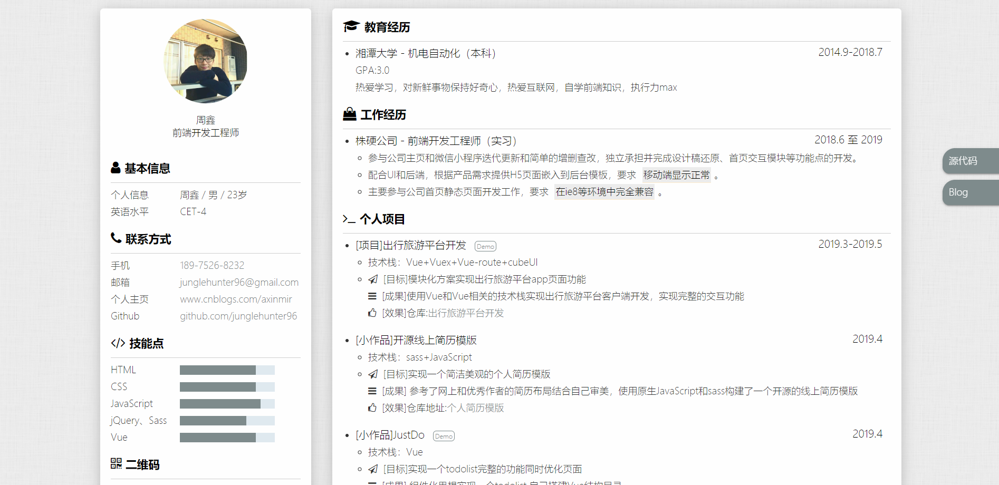
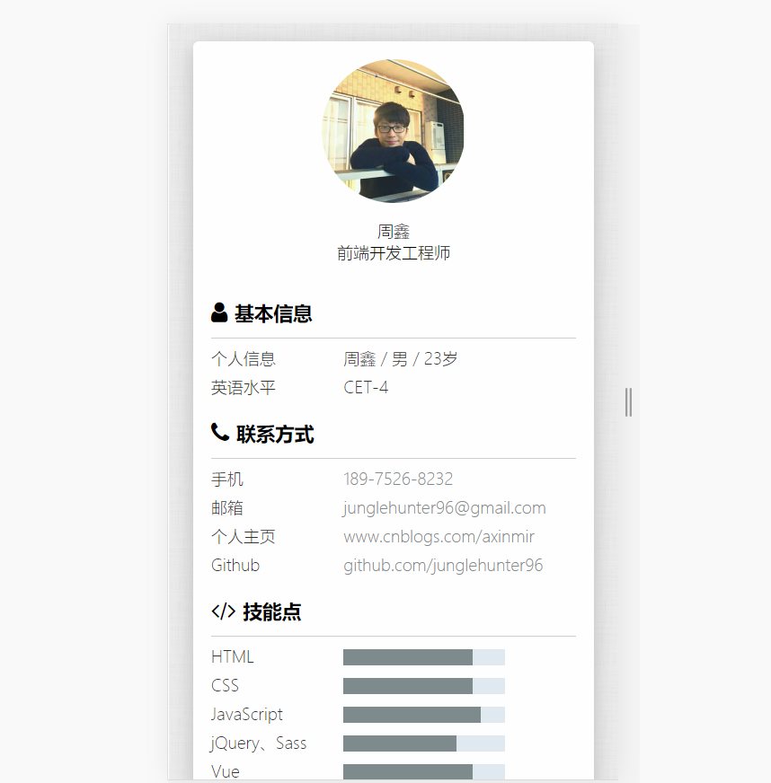

# 个人简历模板

因求职需要，虽网上已有众多模版，但皆与个人需求和个人风格相异，故创建这模版项目，希望能够对其他有求职需要的同志有所帮助

## 介绍

此简历模板：

- 内容上，来源于我本人真实求职经历以及参加多次修改简历总结而成
- 风格上，参考众多开源作者及设计网站简历风格

欢迎各位提issue或者star 感谢

## 项目

前端求职/求职模版

## 使用方法

1. 先Star/Fork本项目，然后Clone或者直接下载到本地
2. 修改index.html 内与个人相关信息
3. 微调样式
5. 部署到线上(建议部署到github page)
6. 生成pdf(开发中)
7. 祝您求职成功！

## 预览
[本人在线简历](https://junglehunter96.github.io/)

### PC端

### 移动端

## TODO
- [ ] 输出pdf功能

## ChangeLog
- 2019.4.27 创建模板
- 添加预览图

## Acknowledgments
- font-awesome提供字体图标
